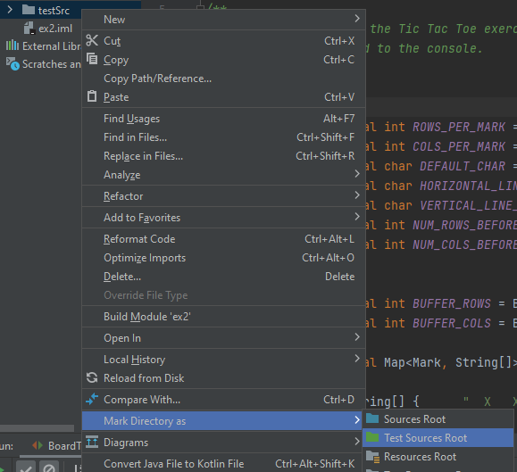
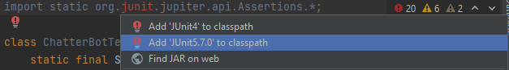

# OOP Ex2 Tests
featured in Exercise 2 of the new "Introduction to OOP" course,
HUJI, Winter 2021-2022 Semester. \
Written by Erel Debel.

<B>Insturctions at the bottom ↓</B>

<B>Important info about CleverPlayerTest and SnartypamtsPlayerTest:</B>
	
Pay attention to the documentation. without any change these classes solely test using the current Board.SIZE and Board.WIN_STREAK values. As documented in these classes it is recommended you <B>temporarily</B> remove the _final_ modifiers from these constant and uncomment the test methods in these classes for a full test of the wanted Win/Lose ratio.
	
Since the printing in _Tournament.playTournament_ wasn't explicitly defined' the tests assume the printed status is in a single line. it expects the results to be either:

 • The last 3 numbers in the string, if the string contains no more than 4 numbers seperated by something. (eg. "13 5 12", "ran 20 rounds. first player got won 12 times, second player won 5 times and there was a draw 13 times.")

 • The strings at indexes -4, -2, -1, if the string contains more than 4 numbers seperated by something. (eg. "Player 1: 13, Player 2: 5, Draws: 12)
 
========================================================================================

<B>The tests can be configured and run by:</B>
1. Put the test directory, _testSrc_, in your project directory (in the same directory as "src" and "out"):

    
	
2. Open the project in _IntelliJ_ if you haven't yet. 

3. Right-click the _testSrc_ directory and choose  
  _Mark Directory as -> Test Sources Root_:
  
	
  
4. Open the file _BoardTest.java_ inside the _testSrc_ directory.

5. On the first line' hover mouse over the red text and press _Alt+Enter_:
 
	

6. Then choose _JUnit 5_:
  
	
  
7. Right-click _testSrc_ directory or press _Ctrl+Shift+F10_ to run all tests:

	

Good luck!\
Erel
